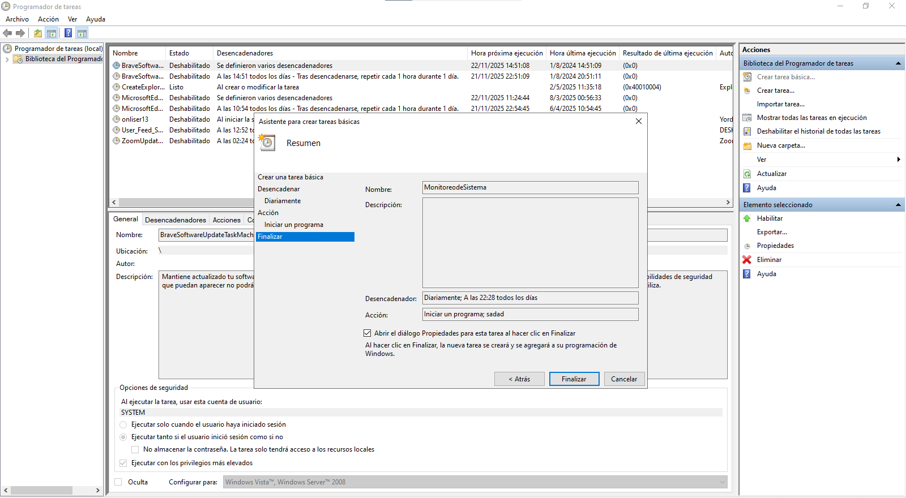
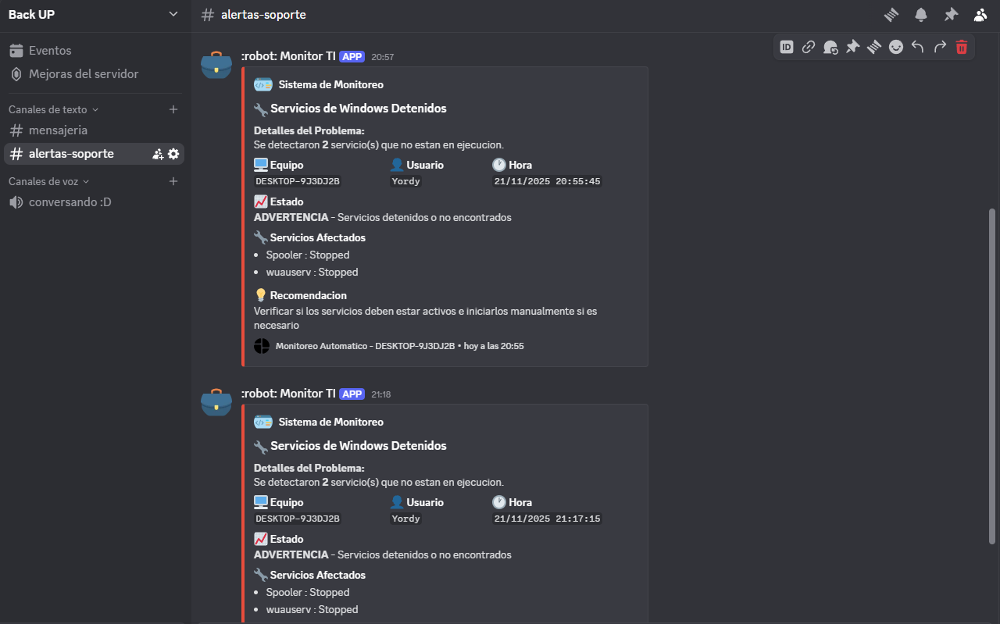
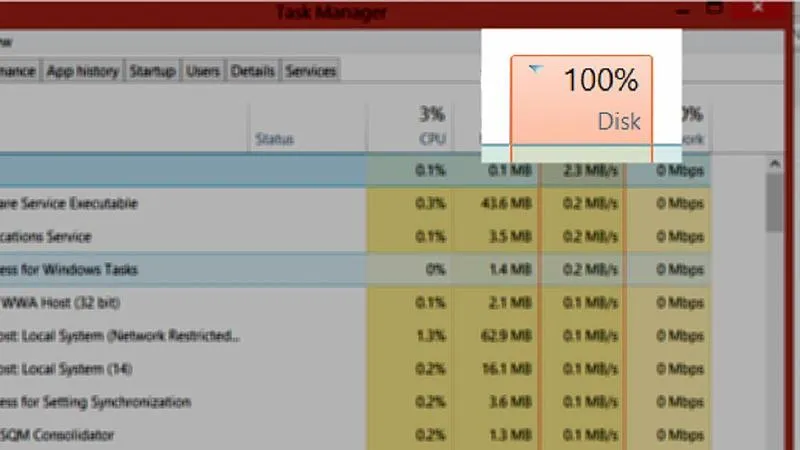
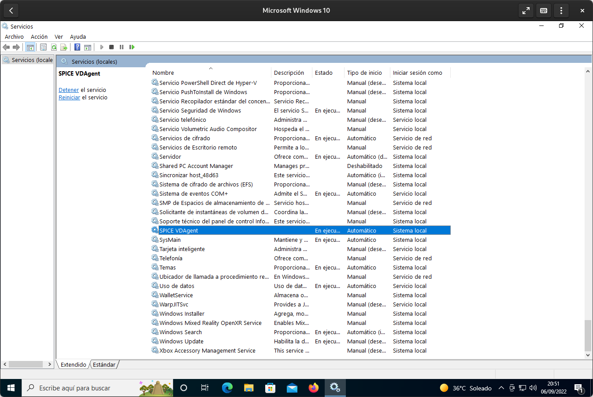

# 🤖 MonitorTI - Sistema de Monitoreo y Alertas a Discord


Un sistema de monitoreo ligero y automatizado para Windows que supervisa el estado de tu PC (CPU, RAM, Disco, Servicios) y envía alertas profesionales a Discord cuando detecta problemas.

---

## 📊 Impacto y Alcance
Este sistema está diseñado para operar en entornos de producción real, demostrando capacidad para:
- **Monitoreo Continuo**: Supervisión 24/7 de recursos críticos (CPU, RAM, Disco) sin intervención humana.
- **Escalabilidad**: Probado en estaciones de trabajo individuales; escalable a múltiples nodos de red mediante despliegue masivo.
- **Registro Histórico**: Generación automática de logs diarios para auditoría y análisis de tendencias de rendimiento.

---

## ✨ Características

- **📊 Monitoreo en Tiempo Real**: Revisa CPU, Memoria RAM, Espacio en Disco y Servicios de Windows.
- **🔔 Alertas Profesionales**: Envía notificaciones a Discord con formato enriquecido (Embeds), colores dinámicos y emojis.
- **🛡️ Sistema Anti-Spam**: Evita alertas repetitivas con un sistema de "cooldown" configurable (por defecto 30 min).
- **📝 Logging Detallado**: Guarda registros diarios de todas las métricas en `C:\MonitoringLogs\`.
- **⚙️ 100% Configurable**: Ajusta umbrales, tiempos y servicios a monitorear fácilmente.
- **🚀 Instalación Automática**: Incluye script para configurar la Tarea Programada de Windows en un clic.

---

## 🚀 Guía de Instalación

### Paso 1: Preparación
1. Clona este repositorio o descarga los archivos en una carpeta (ej: `C:\Monitoreo`).
2. Abre el archivo `Alertas-SOporte.ps1` con un editor de texto.
3. Pega tu Webhook de Discord en la línea 7:
   ```powershell
   $discordWebhookUrl = "https://discord.com/api/webhooks/TU_WEBHOOK_AQUI"
   ```

### Paso 2: Activar el Monitoreo

Tienes dos opciones para activar el monitoreo automático:

## OPCIÓN 1: Usar el Script Automático (RECOMENDADO) ⭐

1. Haz clic derecho en PowerShell y selecciona "Ejecutar como administrador"

2. Navega a la carpeta donde descargaste los archivos:
   cd "C:\Ruta\De\Tu\Carpeta"

3. Ejecuta el configurador:
   .\Configurar-Tarea.ps1

4. ¡Listo! El monitoreo se ejecutará cada 10 minutos automáticamente.

---

## OPCIÓN 2: Configuración Manual

### Paso 1: Abrir Programador de Tareas
- Presiona Win + R
- Escribe: taskschd.msc
- Presiona Enter

### Paso 2: Crear Nueva Tarea
1. En el panel derecho, clic en "Crear tarea básica..."
2. Nombre: MonitoreoSistema-TI
3. Descripción: Monitoreo automático de CPU, RAM, Disco y Servicios
4. Clic en "Siguiente"

### Paso 3: Configurar Desencadenador
1. Selecciona: "Diariamente"
2. Clic en "Siguiente"
3. Fecha de inicio: Hoy
4. Hora: Ahora (cualquier hora)
5. Clic en "Siguiente"

### Paso 4: Configurar Acción
1. Selecciona: "Iniciar un programa"
2. Clic en "Siguiente"
3. Programa o script: powershell.exe
4. Agregar argumentos:
   -NoProfile -ExecutionPolicy Bypass -WindowStyle Hidden -File "C:\Ruta\De\Tu\Carpeta\Alertas-SOporte.ps1"
5. Clic en "Siguiente"

### Paso 5: Finalizar Configuración Básica
1. Marca: "Abrir el cuadro de diálogo Propiedades..."
2. Clic en "Finalizar"

### Paso 6: Configurar Repetición (IMPORTANTE)
1. En la pestaña "Desencadenadores", selecciona el desencadenador y clic en "Editar"
2. Marca: "Repetir la tarea cada:"
3. Selecciona: 10 minutos
4. Durante: Indefinidamente
5. Clic en "Aceptar"

### Paso 7: Configuraciones Adicionales
1. Pestaña "General":
   - Marca: "Ejecutar con los privilegios más altos"
   - Marca: "Ejecutar tanto si el usuario inició sesión como si no"

2. Pestaña "Condiciones":
   - DESMARCA: "Iniciar la tarea solo si el equipo está conectado a la CA"
   - Marca: "Iniciar solo si está disponible la siguiente conexión de red: Cualquiera"

3. Pestaña "Configuración":
   - Marca: "Permitir que la tarea se ejecute a petición"
   - Marca: "Ejecutar la tarea lo antes posible después de perder un inicio programado"
   - "Si la tarea ya se está ejecutando...": Detener la instancia existente

4. Clic en "Aceptar"

> **Nota Visual**: Así debería verse tu tarea programada una vez configurada:
>
> 

---

## Verificar que Funciona

### Método 1: Ejecutar Manualmente
1. Abre Programador de tareas (taskschd.msc)
2. Busca "MonitoreoSistema-TI"
3. Clic derecho → "Ejecutar"
4. Revisa Discord para ver si llegó la alerta (si hay problemas)
5. Revisa el log: C:\MonitoringLogs\monitor_YYYYMMDD.log

### Método 2: Esperar 10 Minutos
- La tarea se ejecutará automáticamente
- Revisa los logs en `C:\MonitoringLogs\`

### 📝 Ejemplo de Log Generado
El sistema genera un registro detallado de cada ejecución. Así se ve un archivo de log típico (`monitor_YYYYMMDD.log`):

```log
2025-11-21 10:00:00	Inicio de monitoreo.
2025-11-21 10:00:00	Tomando muestras de CPU...
2025-11-21 10:00:01	CPU promedio de 3 muestras: 12.5%
2025-11-21 10:00:01	CPU: 12.5% | Memoria usada: 34.2% (10500 MB libres)
2025-11-21 10:00:01	Fin de ejecucion.
```

### Comandos de PowerShell
Puedes ejecutar estos comandos en PowerShell para gestionar la tarea:

```powershell
# Ver estado de la tarea
Get-ScheduledTask -TaskName "MonitoreoSistema-TI"

# Ver historial de ejecuciones
Get-ScheduledTask -TaskName "MonitoreoSistema-TI" | Get-ScheduledTaskInfo

# Ejecutar manualmente ahora mismo
Start-ScheduledTask -TaskName "MonitoreoSistema-TI"

# Desactivar temporalmente
Disable-ScheduledTask -TaskName "MonitoreoSistema-TI"

# Eliminar la tarea por completo
Unregister-ScheduledTask -TaskName "MonitoreoSistema-TI" -Confirm:$false
```

---

## 📸 Evidencias y Resultados

> **[📂 Ver Galería Completa de Evidencias](/evidence/)**  
> *Consulta la carpeta `/evidence` para ver capturas de pantalla de alertas reales y archivos de log generados.*

### Ejemplos de Alertas en Discord
A continuación se muestran los formatos de alerta que genera el sistema:

El sistema envía alertas con diferentes niveles de severidad:

### 🔥 CPU Sobrecargada

> **Estado**: CRÍTICO
> **Mensaje**: El procesador está funcionando al **95%** de su capacidad.

### 💾 Espacio en Disco Bajo

> **Estado**: CRÍTICO
> **Mensaje**: Uno o más discos están quedándose sin espacio (menos del **10%** libre).

### 🔧 Servicios Detenidos

> **Estado**: ADVERTENCIA
> **Mensaje**: Se detectaron servicios que no están en ejecución (ej: Spooler).

---

## 📂 Estructura del Proyecto

```text
📁 MonitorTI/
│
├── 📜 evidence               # evidencia del log
├── 📜 img                    # evidencia  
├── 📜 Alertas-SOporte.ps1    # Script principal (Lógica de monitoreo)
├── 📜 Configurar-Tarea.ps1   # Instalador (Crea la tarea programada)
└── 📜 README.md              # Documentación completa
```

---

## ❓ Solución de Problemas

**No llegan las alertas:**
1. Verifica que el Webhook de Discord sea correcto.
2. Revisa los logs en `C:\MonitoringLogs\` para ver errores.
3. Si acabas de recibir una alerta, espera 30 minutos (sistema anti-spam) o borra el archivo `alert_state.json` en la carpeta de logs para resetear el contador.

**Error de permisos:**
Asegúrate de ejecutar `Configurar-Tarea.ps1` como **Administrador**.

---

## 🛠️ Tecnologías y Habilidades Clave

Este proyecto demuestra dominio técnico en las siguientes áreas:

- **PowerShell Scripting Avanzado**: Creación de scripts modulares, manejo de objetos y variables de entorno.
- **Administración de Sistemas Windows**: Uso de WMI/CIM para extracción de métricas de hardware y gestión de servicios.
- **Automatización de Infraestructura**: Configuración programática del Programador de Tareas (Task Scheduler).
- **Integración de APIs**: Comunicación con servicios externos (Discord) mediante Webhooks y cargas JSON.
- **Manejo de Logs y Errores**: Implementación de sistemas de registro robustos para depuración y auditoría.

---

## 📄 Licencia

Este proyecto es de uso libre. ¡Siéntete libre de modificarlo y mejorarlo!
